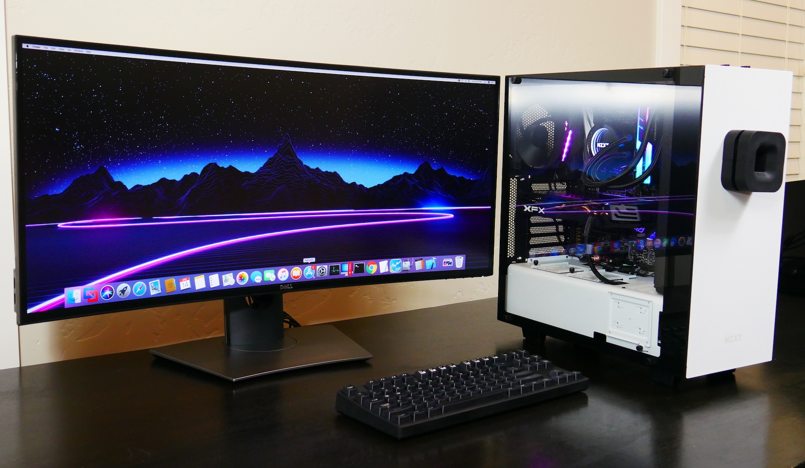

### Hackintosh goals 👇

### Exploring my first hackintosh 🍎🖥️
My son is currently using an ancient 2014 Macbook Pro that has a 4th Gen Haswell Intel i5-4308U (2 core) @ 2.8 GHz processor and 8 paltry GB of RAM. We plug it into a Thunderbolt Display and mostly use it as a tethered desktop since the battery on it barely holds a charge. It has had the dreaded `Service Battery` indicator on it for the last year. I haven't built a machine since Pentiums were a thing so I've been wanting to explore the hardware world again and with Apple transitioning to their own ARM based M1 silicon, the opportunity to build a hackintosh is dwindling. Time to dive in.

### Parts galore, holy 💩
A lot has changed since those Pentium days. Cases come in all shapes and sizes and therefore corresponding motherboards and other components come in a variety of sizes as well. You can build a small form factor [mini](https://osy.gitbook.io/hac-mini-guide/) using an intel nuc or a full blown i9 Octo core [desktop](https://www.tonymacx86.com/threads/success-gigabyte-designare-z390-i9-9900k-sapphire-rx-5700-xt-nitro-se-lg-34wk95u-w.292101/) beast. I dove down the rabbit hole and had a little bit of paralysis by analysis - liquid cooling CPUs, RGB fans, RGB RAM chips, and GPUs all colluded to prevent me from figuring out what needed to be done. I needed to put together some basic requirements to frame up what needed to be done.

### Never ask a 10 year old 🤦‍♂️
Since this was going to be my son's machine, I figured I'd ask him what he wanted. And since he is, you know, 10, he based his requirements entirely on aesthetics. Apparently his only requirement is to have RGB lighting on everything possible thereby proving despite being born in New York City, New Jersey still runs in his DNA. He also wants a tempered glass case where you can see all the parts inside. I'm down with these requirements but I won't get into details with him about what's possible with RGB LED controllers. He can add that on his own and perhaps it will be a learning opportunity for him.
#### This is what he's picturing...

<blockquote class="twitter-tweet">
O11 Dynamic Min/Max Building Guide from <a href="https://twitter.com/tomshardware?ref_src=twsrc%5Etfw">@tomshardware</a>  Max shiny parts, Max frames, Min noise. <a href="https://t.co/gV8JJqupeh">https://t.co/gV8JJqupeh</a><a href="https://twitter.com/hashtag/LIANLI?src=hash&amp;ref_src=twsrc%5Etfw">#LIANLI</a> <a href="https://twitter.com/hashtag/O11D?src=hash&amp;ref_src=twsrc%5Etfw">#O11D</a> <a href="https://twitter.com/hashtag/o11dynamic?src=hash&amp;ref_src=twsrc%5Etfw">#o11dynamic</a> <a href="https://twitter.com/hashtag/pcmr?src=hash&amp;ref_src=twsrc%5Etfw">#pcmr</a> <a href="https://twitter.com/hashtag/specialedition?src=hash&amp;ref_src=twsrc%5Etfw">#specialedition</a> <a href="https://twitter.com/hashtag/pcaddicts?src=hash&amp;ref_src=twsrc%5Etfw">#pcaddicts</a> <a href="https://twitter.com/hashtag/pc?src=hash&amp;ref_src=twsrc%5Etfw">#pc</a> <a href="https://twitter.com/hashtag/Computer?src=hash&amp;ref_src=twsrc%5Etfw">#Computer</a> <a href="https://twitter.com/hashtag/PCGaming?src=hash&amp;ref_src=twsrc%5Etfw">#PCGaming</a> <a href="https://twitter.com/hashtag/pcgamer?src=hash&amp;ref_src=twsrc%5Etfw">#pcgamer</a> <a href="https://twitter.com/hashtag/pcmasterrace?src=hash&amp;ref_src=twsrc%5Etfw">#pcmasterrace</a> <a href="https://twitter.com/hashtag/RGB?src=hash&amp;ref_src=twsrc%5Etfw">#RGB</a> <a href="https://twitter.com/hashtag/pcbuild?src=hash&amp;ref_src=twsrc%5Etfw">#pcbuild</a> <a href="https://twitter.com/hashtag/PCGamers?src=hash&amp;ref_src=twsrc%5Etfw">#PCGamers</a> <a href="https://twitter.com/hashtag/CustomPC?src=hash&amp;ref_src=twsrc%5Etfw">#CustomPC</a> <a href="https://twitter.com/hashtag/gamingrig?src=hash&amp;ref_src=twsrc%5Etfw">#gamingrig</a> <a href="https://t.co/RIA2n4HTEr">pic.twitter.com/RIA2n4HTEr</a>
&mdash; LIAN LI Global (@GlobalLianli) <a href="https://twitter.com/GlobalLianli/status/1305129378620280833?ref_src=twsrc%5Etfw">September 13, 2020</a></blockquote>  

### Items for consideration 🎬
In order to keep this process moving forward I'll keep documenting my requirements here and take notes on things learned during each iteration. Below are a few areas to explore:

* Which bootloader Opencore or Clover?
* Will these support dual boot to linux? Potentially Windows?
* Can I use my Thunderbolt Monitor with its ports, speakers, and camera?
* Will wifi, bluetooth, airplay, airdrop all work?
* Intel or AMD Ryzentosh? 
* Which form factor? ITX? ATX?
* AMD or NVIDIA GPU?

### Time to get cracking 🏴‍☠️🚢
I hope to start cobbling together all the parts soon. There are still a number of things I'm thing about that I'll detail in the next post prior to ordering all the parts.