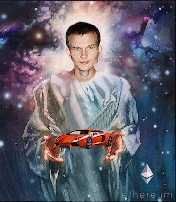
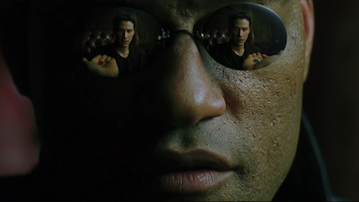

When we last left off, I tried to create a framework for what decentralization was in the context of Bitcoin. If you're here, you should have an understanding of why decentralization with a simple thing like bitcoin is a BFD. If you want to see what it's like when your normie Uncle falls down the rabbit hole please read Ray Dalio's recent [treatise](https://www.bridgewater.com/research-and-insights/ray-dalio-what-i-think-of-bitcoin) on bitcoin. 

<i>"I believe Bitcoin is one hell of an invention. -- Ray Dalio"</i>

It is important to have a solid understanding of what decentralization is before we move on so if you haven't read my first post on the topic, start [here](https://www.andrewyao.me/ohai/). The ultimate goal is to understand Decentralized Finance (DeFi) so I've glossed over a lot of detail and tried to leave links to important concepts that you have to take my word for until you have time to read and explore.

Reading Dalio's enlightenment on Bitcoin reminds me of seeing the first few articles come out about Napster from record label executives as they understood what digitization and peer to peer (P2P) distribution would do to their industry. It was that feeling I got when I heard Radiohead's [Kid A](https://open.spotify.com/album/6GjwtEZcfenmOf6l18N7T7?si=__betqTaRi6Pyd92adoDKQ) before it was released. Napster was decentralized in that the sharing was done peer to peer but clients still sent lists of what they could share to a server and there was still an actual entity for the RIAA to go after. Subsequent iterations like Gnutella fixed some of those problems by being fully distributed, open protocols. There were no longer servers or a network to shutdown and no corporate entity to litigate. The RIAA needed to lean on Internet Service Providers (ISPs) to detect protocol traffic and help them protect their copyrights. There's no central point to choke off digital file sharing when it is fully decentralized.

Bitcoin is fully decentralized, digital gold. If this were the 90s, we might call it Napster for Money, or in the modern era, Bittorrent for Money; P2P money. It is a currency that exists without a sovereign and operates without a central bank. Anyone can become a node or a miner, many of which are needed, whom enable the financial network to operate. It has a fixed supply (scarcity) and cannot easily be shutdown. Currently fiat on/off ramps are the regulatory choke points, but if it becomes widely accepted as tender, those go away as well.

The next concept we will discuss is decentralized computing and [Ethereum](https://decrypt.co/resources/what-is-ethereum-quickly-explained-four-minute-guide). I'll probably move pretty quickly here because Ethereum itself touches a lot of computer science concepts like [Turing completeness](https://www.youtube.com/watch?v=dNRDvLACg5Q), public key cryptography, and [Merkle tries](https://en.wikipedia.org/wiki/Merkle_tree). Although core to understanding how Ethereum works, a leap of faith one must take to get to DeFi is that Ethereum is a decentralized computer that anyone can write and run  generalized programs on. Understanding how this layer (layer 1) works isn't as important. The currency, Ether (ETH), is used to pay for compute transactions and is currently the second largest cryptocurrency by market cap at $150B.

Anyone can write a decentralized app (DApp) and dep
